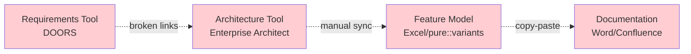
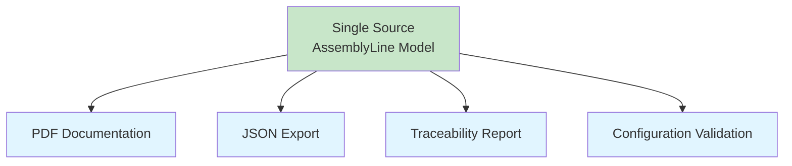
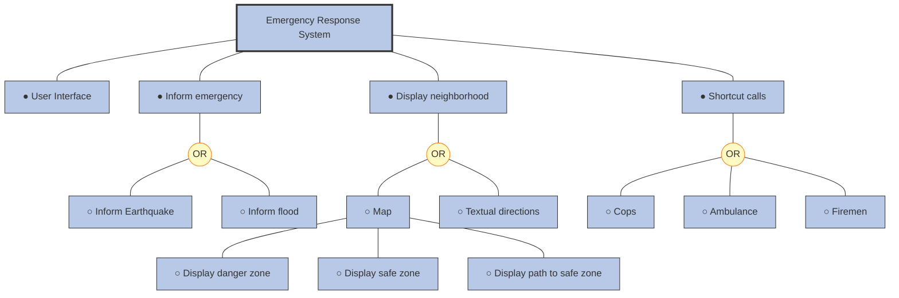
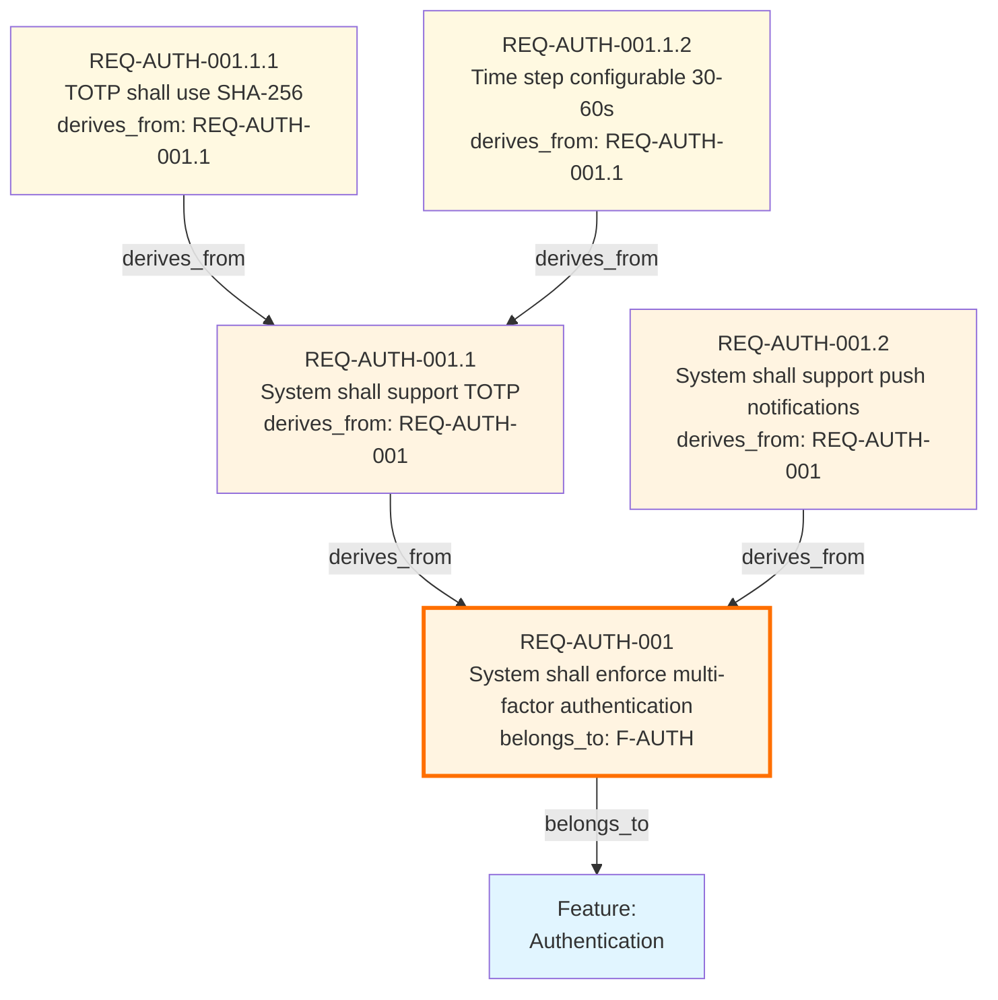
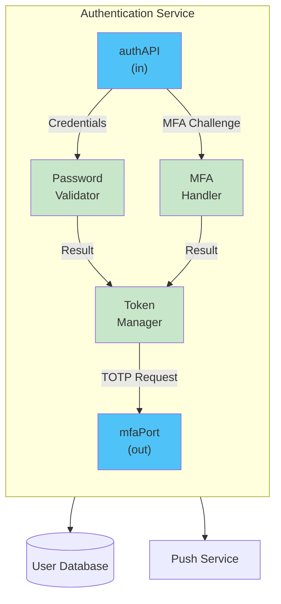
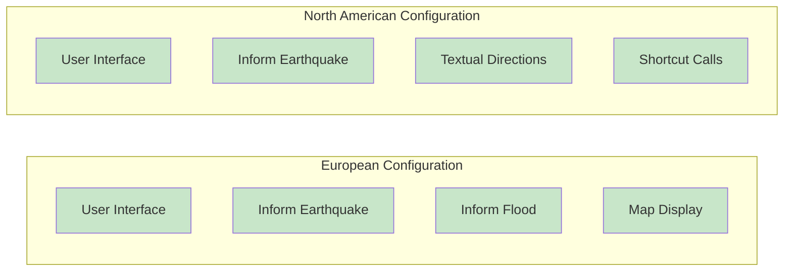
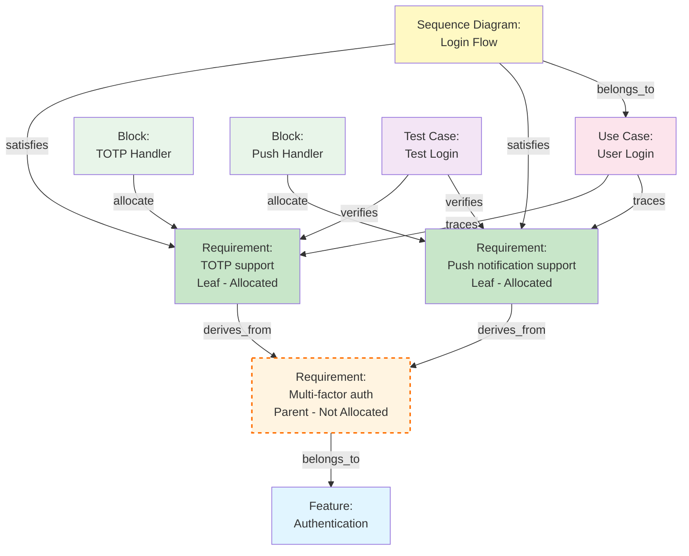
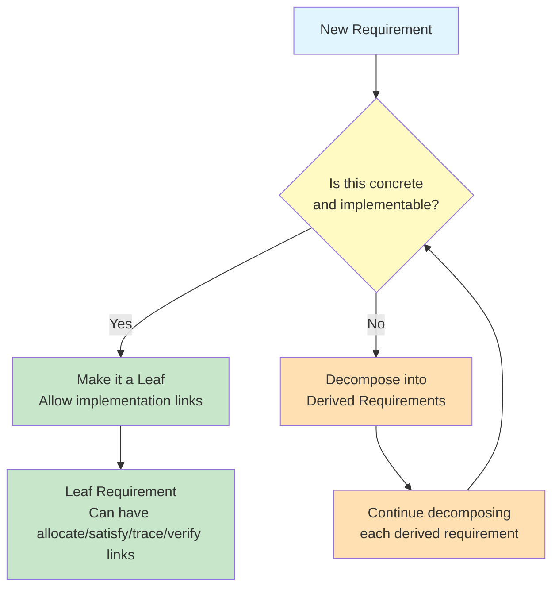
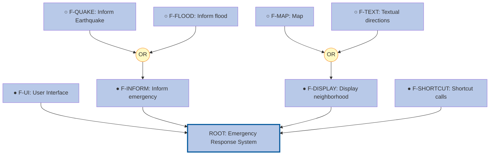

# AssemblyLine Modeling Language: User Guide

## Introduction

### What is AssemblyLine?

AssemblyLine is a **text-based modeling language** for systems engineering that helps you define, organize, and track complex product families. Think of it as a unified way to express:

- **What** your product can do (features)
- **What** it must do (requirements)
- **How** it behaves (use cases)
- **How** it's built (architecture)
- **Which** variants you offer (configurations)

All in plain text files that you can version control, review, and collaborate on—just like code.

### Why AssemblyLine?

Modern products come in families, not single versions:
- A security platform might have **Enterprise**, **SMB**, and **Consumer** editions
- An automotive system might have **Base**, **Sport**, and **Luxury** variants
- A medical device might have **US**, **EU**, and **Asia** configurations

Each variant shares common components but differs in specific features. Managing this complexity traditionally requires:



**Problems with this approach:**
- Traceability breaks when tools don't talk to each other
- Manual synchronization is error-prone
- Impact analysis is nearly impossible
- Compliance verification takes weeks
- Nobody knows the "true" specification

**AssemblyLine's solution:**



**Single source of truth** in version-controlled text files
**Built-in traceability** with automatic validation
**Variability management** with feature models
**Professional output** with typeset-quality PDFs
**Tool integration** via JSON export

---

## Core Concepts

AssemblyLine is built on four interconnected modeling dimensions:

### 1. Features: What Can It Do?

**Features** represent capabilities your product family offers. They organize around **variability**—what changes between product variants.



**Key concepts:**
- **● Mandatory features**: Every product variant includes these
- **○ Optional features**: Some product variants include these
- **OR groups** (yellow circle): Pick at least one (can select multiple)
- **XOR groups**: Pick exactly one alternative (mutually exclusive)

### 2. Requirements: What Must It Do?

**Requirements** specify exactly what each feature must do. They form a hierarchy through decomposition:



**Two-level traceability:**
- **Top-level requirements** link to features (`belongs_to`)
- **Derived requirements** decompose parents (`derives_from`)
- **Rule**: Every requirement has exactly ONE parent link

### 3. Architecture: How Is It Built?

**Architecture** uses SysML-style blocks to show system structure:



**Key elements:**
- **Blocks**: Components with properties, operations, and ports
- **Ports**: Interfaces for communication
- **Connectors**: Message flows between components
- **Parts**: Internal sub-components

### 4. Configurations: Which Variants Do We Offer?

**Configurations** select specific features for each product variant:



---

## The Traceability Web

AssemblyLine's power comes from **linking everything together**:



**Traceability links:**
- Features → Requirements: `belongs_to` (top-level requirements link to features)
- Requirements → Requirements: `derives_from` (decomposition into more specific requirements)
- Use Cases → **Leaf Requirements**: `trace` (validation - ONLY to leaf requirements)
- Diagrams → **Leaf Requirements**: `satisfy` (implementation - ONLY to leaf requirements)
- Blocks → **Leaf Requirements**: `allocate` (ownership/responsibility - ONLY to leaf requirements)
- Tests → **Leaf Requirements**: `verify` (verification - ONLY to leaf requirements)

**Critical constraint (Rule 2):**
- **Parent requirements** (R1 - shown with dashed border) have derived requirements, so they CANNOT have ANY incoming links except `derives_from` from their children
- **Leaf requirements** (R2, R3 - shown with solid green fill) have no derived requirements, so they CAN receive all types of links
- ALL implementation, validation, and verification links point ONLY to leaf requirements

**Why this matters:**
- **Impact analysis**: "Which requirements does feature X affect?"
- **Coverage**: "Which requirements aren't tested?"
- **Compliance**: "Prove every requirement is implemented"
- **Change management**: "What breaks if I change this?"
- **Clear ownership**: Each block owns specific leaf requirements (R2, R3), not abstract parents (R1)

### Complete Link Types Reference

AssemblyLine supports the following traceability link types:

| Link Type | From Element | To Element | Meaning | Example Usage |
|-----------|--------------|------------|---------|---------------|
| `belongs_to` | Requirement | Feature | Top-level requirement belongs to feature | High-level req implements feature capability |
| `derives_from` | Requirement | Requirement | Requirement decomposes parent | Child req refines/decomposes parent req |
| `child_of` | Feature | Feature | Feature hierarchy (implicit via `parent` parameter) | Feature has parent feature |
| `trace` | Use Case | Requirement (Leaf) | Use case validates requirement behavior | UC tests req functionality |
| `allocate` | Block | Requirement (Leaf) | Block owns/implements requirement | Component responsible for req |
| `satisfy` | Block/Diagram/Implementation | Requirement (Leaf) | Element satisfies requirement | Design/code meets req |
| `belongs_to` | Diagram | Use Case | Diagram visualizes use case | Sequence diagram shows UC flow |
| `verify` | Test Case | Requirement (Leaf) | Test verifies requirement | Test validates req implementation |

**Mutual Exclusivity Rules:**

1. **Requirement parent link**: Every requirement has exactly ONE of:
   - `belongs_to: "FEATURE-ID"` (top-level requirement)
   - `derives_from: "REQ-ID"` (derived requirement)
   - Never both, never neither

2. **Requirement type**: Requirements are EITHER:
   - **Leaf requirements** (no derived requirements) → CAN receive `allocate`, `satisfy`, `trace`, `verify` links
   - **Parent requirements** (have derived requirements) → CANNOT receive `allocate`, `satisfy`, `trace`, `verify` links

3. **Allocation limit**: Each requirement can be allocated to AT MOST one block

---

## Fundamental Modeling Rules

AssemblyLine enforces structural rules that govern how models can grow and evolve. These rules ensure consistency, traceability, and architectural clarity.

### Rule 1: Requirements Must Have a Parent

**Every requirement must have exactly one parent relationship.**

A requirement can have:
- **Feature parent** (via `belongs_to: "FEATURE-ID"`): Top-level requirements that directly implement a feature
- **Requirement parent** (via `derives_from: "REQ-ID"`): Derived requirements that decompose a parent requirement

**Valid examples:**

```typst
// Top-level requirement linked to feature
#req("REQ-AUTH-001",
  belongs_to: "F-AUTH",
  tags: (type: "functional")
)[
  The system shall enforce multi-factor authentication.
]

// Derived requirement linked to parent requirement
#req("REQ-AUTH-001.1",
  derives_from: "REQ-AUTH-001",
  tags: (type: "functional")
)[
  The system shall support TOTP (RFC 6238) as second factor.
]
```

**Invalid examples:**

```typst
// INVALID: No parent relationship
#req("REQ-ORPHAN", tags: (type: "functional"))[
  This requirement has no parent.
]

// INVALID: Both parent relationships
#req("REQ-BOTH",
  belongs_to: "F-AUTH",
  derives_from: "REQ-AUTH-001"
)[
  Cannot have both feature parent and requirement parent.
]
```

**Rationale:** Every requirement must trace back to a feature through the parent chain. This ensures complete traceability from features to implementation-level requirements.

### Rule 2: Requirement Decomposition Isolation

**If a requirement is decomposed (has derived requirements), it cannot have ANY incoming links except `derives_from` links from its children.**

This rule enforces strict separation between abstract (parent) and concrete (leaf) requirements.

**The rule states:**
1. If a requirement has derived requirements (other requirements point to it via `derives_from`), then it is a **parent requirement**
2. Parent requirements CANNOT receive:
   - `allocate` links from blocks (ownership)
   - `satisfy` links from diagrams (implementation)
   - `trace` links from use cases (validation)
   - `verify` links from test cases (verification)
   - Any other incoming links except `derives_from`
3. Only **leaf requirements** (those with no derived requirements) can receive implementation, allocation, and verification links

#### Allocation Rule

A requirement can be allocated to a single block using the `allocate` link:

```typst
#req("REQ-AUTH-001.1.1",
  derives_from: "REQ-AUTH-001.1",
  tags: (type: "functional")
)[
  The TOTP implementation shall use SHA-256 hash algorithm.
]

#block_definition(
  "BLK-MFA-HANDLER",
  title: "Multi-Factor Authentication Handler",
  // ... properties, operations, ports ...
  links: (
    allocate: ("REQ-AUTH-001.1.1",)  // Allocated to this block
  )
)[]
```

#### Mutual Exclusion: Parent Requirements vs. Leaf Requirements

**A requirement is either a parent (has derived requirements) OR a leaf (can receive implementation/verification links). Never both.**

**Case 1: Leaf requirement (allocatable, implementable, verifiable)**

```typst
// Leaf requirement - allocated to a block
#req("REQ-CRYPTO-001",
  derives_from: "REQ-AUTH-001.1",
  tags: (type: "functional")
)[
  Cryptographic operations shall use hardware acceleration when available.
]

#block_definition("BLK-CRYPTO-MODULE",
  links: (allocate: ("REQ-CRYPTO-001",))  // This block owns this requirement
)[]

#use_case("UC-CRYPTO",
  links: (trace: ("REQ-CRYPTO-001",))  // Use case can trace to leaf requirement
)[]

#sequence_diagram("SD-CRYPTO",
  links: (satisfy: ("REQ-CRYPTO-001",))  // Diagram can satisfy leaf requirement
)[]

// VALID: No further decomposition - this is a leaf requirement
// INVALID: Cannot create REQ-CRYPTO-001.1 because REQ-CRYPTO-001 has incoming links
```

**Case 2: Parent requirement (abstract, must be decomposed)**

```typst
// High-level requirement - too abstract for direct implementation
#req("REQ-SYSTEM-001",
  belongs_to: "F-SECURITY",
  tags: (type: "functional")
)[
  The system shall provide end-to-end security for all user data.
]

// INVALID: Cannot have ANY of these links - this requirement will be decomposed
// #block_definition("BLK-X", links: (allocate: ("REQ-SYSTEM-001",)))[]  // NO!
// #use_case("UC-X", links: (trace: ("REQ-SYSTEM-001",)))[]  // NO!
// #sequence_diagram("SD-X", links: (satisfy: ("REQ-SYSTEM-001",)))[]  // NO!

// MUST decompose into specific requirements:

#req("REQ-SYSTEM-001.1",
  derives_from: "REQ-SYSTEM-001"
)[
  Authentication service shall validate all user credentials.
]

#req("REQ-SYSTEM-001.2",
  derives_from: "REQ-SYSTEM-001"
)[
  Database layer shall encrypt all data at rest using AES-256.
]

#req("REQ-SYSTEM-001.3",
  derives_from: "REQ-SYSTEM-001"
)[
  Network layer shall enforce TLS 1.3 for all communications.
]

// Now each leaf requirement can receive all types of links
#block_definition("BLK-AUTH-SERVICE",
  links: (allocate: ("REQ-SYSTEM-001.1",))
)[]

#use_case("UC-LOGIN",
  links: (trace: ("REQ-SYSTEM-001.1",))
)[]

#block_definition("BLK-DATABASE",
  links: (allocate: ("REQ-SYSTEM-001.2",))
)[]

#sequence_diagram("SD-ENCRYPT",
  links: (satisfy: ("REQ-SYSTEM-001.2",))
)[]

#block_definition("BLK-NETWORK-MGR",
  links: (allocate: ("REQ-SYSTEM-001.3",))
)[]

#test_case("TC-TLS",
  links: (verify: ("REQ-SYSTEM-001.3",))
)[]
```

#### Workflow: Removing Links to Allow Decomposition

If you discover that a requirement with implementation/verification links needs decomposition:

```typst
// STEP 1: Initial state - requirement has implementation links
#req("REQ-AUTH-100",
  belongs_to: "F-AUTH"
)[
  The system shall provide secure authentication.
]

#block_definition("BLK-AUTH",
  links: (allocate: ("REQ-AUTH-100",))
)[]

#use_case("UC-AUTH",
  links: (trace: ("REQ-AUTH-100",))
)[]

#sequence_diagram("SD-AUTH",
  links: (satisfy: ("REQ-AUTH-100",))
)[]

// STEP 2: Realize REQ-AUTH-100 is too broad - needs decomposition
// MUST remove ALL incoming links first:

#block_definition("BLK-AUTH",
  links: (allocate: ())  // Remove allocate link
)[]

#use_case("UC-AUTH",
  links: (trace: ())  // Remove trace link
)[]

#sequence_diagram("SD-AUTH",
  links: (satisfy: ())  // Remove satisfy link
)[]

// STEP 3: Now decompose into allocatable requirements

#req("REQ-AUTH-100.1",
  derives_from: "REQ-AUTH-100"
)[
  Password validation shall enforce complexity rules.
]

#req("REQ-AUTH-100.2",
  derives_from: "REQ-AUTH-100"
)[
  MFA handler shall support TOTP and push notifications.
]

// STEP 4: Re-establish links to leaf requirements

#block_definition("BLK-PASSWORD-VALIDATOR",
  links: (allocate: ("REQ-AUTH-100.1",))
)[]

#use_case("UC-AUTH",
  links: (trace: ("REQ-AUTH-100.1", "REQ-AUTH-100.2"))  // Trace to specific requirements
)[]

#block_definition("BLK-MFA-HANDLER",
  links: (allocate: ("REQ-AUTH-100.2",))
)[]

#sequence_diagram("SD-AUTH",
  links: (satisfy: ("REQ-AUTH-100.1", "REQ-AUTH-100.2"))  // Satisfy specific requirements
)[]
```

#### Decision Flow: Allocate or Decompose?



**Decision criteria:**
- **Make it a leaf** if: Requirement is specific enough to be implemented, verified, and tested directly
- **Decompose** if: Requirement is too abstract or spans multiple concerns
- **Stop decomposing** when: Each requirement is concrete and implementable

**Rationale:** This rule ensures:
- **Clear separation**: Abstract requirements (organizational) vs. concrete requirements (implementable)
- **No ambiguity**: Only leaf requirements have actual implementation/verification artifacts
- **Proper granularity**: Forces decomposition until requirements are concrete and testable
- **Clean traceability**: Implementation artifacts (blocks, diagrams, tests) link only to concrete requirements
- **Coverage analysis**: Easy to verify that all leaf requirements are implemented and tested

### Rule 3: Feature Hierarchy

**Every feature must have exactly one parent feature, except the root feature. There can be only one root feature.**

#### Single Root

```typst
// VALID: Single root feature
#feature("Product Family", id: "ROOT",
  tags: (version: "2.0")
)[
  The complete product family specification.
]

// INVALID: Second root feature
#feature("Another Root", id: "ROOT2")[
  // ERROR: Only one feature can have no parent
]
```

#### All Features Have Parents

```typst
// VALID: Feature hierarchy
#feature("Product Family", id: "ROOT")[]

#feature("Security", id: "F-SECURITY",
  parent: "ROOT"  // Parent specified
)[]

#feature("Authentication", id: "F-AUTH",
  parent: "F-SECURITY"  // Parent specified
)[]

// INVALID: Orphan feature
#feature("Orphan", id: "F-ORPHAN")[
  // ERROR: No parent specified and not root
]

// INVALID: Non-existent parent
#feature("Auth", id: "F-AUTH",
  parent: "F-NONEXISTENT"  // ERROR: Parent doesn't exist
)[]
```

#### Valid Feature Tree Structure



**Rationale:**
- **Unambiguous hierarchy**: Clear parent-child relationships
- **Traceability**: Requirements can trace to features through well-defined paths
- **Configuration management**: Feature selection follows clear tree structure
- **Prevents orphans**: All features connected to product definition

### Summary: Fundamental Rules Quick Reference

| Rule | Element | Constraint | Purpose |
|------|---------|------------|---------|
| **Rule 1** | Requirements | Must have exactly ONE parent: `belongs_to` (feature) XOR `derives_from` (requirement) | Ensures complete traceability chain |
| **Rule 2** | Requirements | Parent requirements (with derived requirements) CANNOT have ANY incoming links except `derives_from` | Forces strict separation: abstract parents vs. concrete leaves |
| **Rule 2** | Requirements | ONLY leaf requirements (no derived requirements) can have `satisfy`, `trace`, `verify` links | Only concrete requirements get implemented/verified |
| **Rule 3** | Features | Every feature must have parent (except root). Only ONE root feature allowed. | Ensures single, well-defined feature hierarchy |

**Key principle:** These rules work together to create a **clean, traceable model** where:
- Every requirement traces back to a business feature (Rule 1)
- Abstract requirements organize, concrete requirements implement (Rule 2)
- Only leaf requirements connect to implementation artifacts (blocks, diagrams, tests)
- The feature tree forms a single, navigable hierarchy (Rule 3)

---

## Language Syntax

### Features

Define capabilities with variability:

```typst
#feature("Inform emergency",
  id: "F-INFORM",            // Unique identifier
  concrete: true,            // Can be selected in configs?
  parent: "ROOT",            // Parent feature ID
  tags: (                    // Extensible metadata
    priority: "P1",
    owner: "Emergency Team",
    cost: "+0 EUR"
  )
)[
  System shall inform users about emergency situations.
]
```

**OR groups** (at least one child):

```typst
// Parent with OR group
#feature("Inform emergency",
  id: "F-INFORM",
  concrete: false,           // Not selectable (abstract)
  parent: "ROOT",
  group: "OR"                // Can select multiple
)[]

// Alternative 1
#feature("Inform Earthquake",
  id: "F-QUAKE",
  parent: "F-INFORM"
)[]

// Alternative 2
#feature("Inform flood",
  id: "F-FLOOD",
  parent: "F-INFORM"
)[]
```

**XOR groups** (exactly one child):

```typst
#feature("Display neighborhood",
  id: "F-DISPLAY",
  parent: "ROOT",
  group: "XOR"               // Pick exactly one
)[]

#feature("Map", id: "F-MAP", parent: "F-DISPLAY")[]
#feature("Textual directions", id: "F-TEXT", parent: "F-DISPLAY")[]
```

### Feature Parameters

**Parametric features** allow features to have configurable values that can be set differently in each product configuration. This enables fine-grained customization beyond just selecting/deselecting features.

#### Parameter Types

AssemblyLine supports three parameter types:

**Integer Parameters** with range constraints:

```typst
#feature("Data Cache", id: "F-CACHE",
  parent: "ROOT",
  parameters: (
    cache_size: (
      "Integer",                    // Type
      (16, 512),                    // Range: min=16, max=512
      "MB",                         // Unit
      128,                          // Default value
      "Size of data cache in memory"  // Description
    )
  )
)[
  Configurable in-memory data cache for improved performance.
]
```

**Boolean Parameters** for toggles:

```typst
#feature("Compression", id: "F-COMPRESS",
  parent: "ROOT",
  parameters: (
    enable_compression: (
      "Boolean",                    // Type
      none,                         // No range for boolean
      none,                         // No unit
      false,                        // Default value
      "Enable data compression"
    )
  )
)[
  Optional data compression to reduce storage requirements.
]
```

**Enum Parameters** for multiple choice:

```typst
#feature("Logging", id: "F-LOG",
  parent: "ROOT",
  parameters: (
    log_level: (
      "Enum",                       // Type
      ("DEBUG", "INFO", "WARN", "ERROR"),  // Allowed values
      none,                         // No unit
      "INFO",                       // Default value
      "Logging verbosity level"
    )
  )
)[
  Configurable application logging.
]
```

#### Constraints and Dependencies

Features can specify constraints that must be satisfied across parameters:

```typst
#feature("Performance Tuning", id: "F-PERF",
  parent: "ROOT",
  parameters: (
    cache_size: ("Integer", (16, 512), "MB", 128, "Cache size"),
    enable_compression: ("Boolean", none, none, false, "Enable compression")
  ),
  constraints: (
    // Compression requires larger cache
    "enable_compression == true => cache_size >= 128"
  ),
  requires: ("F-BASE"),    // Feature dependencies
)[
  Performance features with interdependent parameters.
]
```

#### Parameter Bindings in Configurations

Configurations bind specific values to feature parameters:

```typst
#config(
  "CFG-SMALL",
  title: "Small Deployment",
  root_feature_id: "ROOT",
  selected: ("F-CACHE", "F-COMPRESS", "F-LOG"),
  bindings: (
    "F-CACHE": (
      cache_size: 64              // Override default 128 → 64 MB
    ),
    "F-COMPRESS": (
      enable_compression: true    // Enable compression
    ),
    "F-LOG": (
      log_level: "WARN"          // Only warnings and errors
    )
  ),
  tags: (deployment: "edge")
)
```

**Parameter validation:**
- Unbound parameters use their default values
- Parameters without defaults AND without bindings cause validation errors
- Integer values must be within declared range
- Enum values must be in declared values list

**Visualization in feature tree:**

Parameter bindings are displayed as a bullet list below each selected feature:

```
● F-CACHE – Cache System
  ├ cache_size: 64 MB (range: 16-2048, default: 128)
● F-COMPRESS – Data Compression
  ├ enable_compression: true (default: false)
● F-LOG – Logging System
  ├ log_level: WARN (values: DEBUG, INFO, WARN, ERROR, default: INFO)
```

Each parameter shows:
- **Current value** (in black) with unit if defined
- **Valid range** (for Integer) or **allowed values** (for Enum)
- **Default value** for comparison

Metadata appears in light grey to distinguish from the configured value.

### Feature Constraints

**Feature constraints** express dependencies and conflicts between features. They appear next to each feature in the feature tree visualization.

#### Implies (Requires) Relationship

Use the `requires` tag to specify that selecting a feature automatically requires other features:

```typst
#feature("Credit Card Payment", id: "F-CREDIT-CARD",
  parent: "F-PAYMENT",
  tags: (
    requires: "F-PCI-COMPLIANCE"    // Implies F-PCI-COMPLIANCE
  )
)[
  Credit card payment processing. Requires PCI compliance.
]

#feature("PCI Compliance", id: "F-PCI-COMPLIANCE",
  parent: "F-SECURITY"
)[
  PCI DSS compliance for credit card handling.
]
```

**Multiple dependencies:**

```typst
#feature("Distributed Database", id: "F-DISTRIBUTED-DB",
  parent: "F-STORAGE",
  tags: (
    requires: ("F-CLOUD", "F-REPLICATION")  // Array for multiple
  )
)[
  Distributed database system requiring cloud infrastructure and replication.
]
```

**Visualization in feature tree:**
```
● F-CREDIT-CARD – Credit Card Payment (implies F-PCI-COMPLIANCE)
● F-DISTRIBUTED-DB – Distributed Database (implies F-CLOUD, F-REPLICATION)
```

The constraint appears in small text next to the feature name. The referenced feature IDs are **clickable links** that navigate to the target feature.

#### Excludes (Mutual Exclusion) Relationship

Use the `excludes` tag to specify features that cannot be selected together:

```typst
#feature("Cryptocurrency Payment", id: "F-CRYPTO",
  parent: "F-PAYMENT",
  tags: (
    excludes: "F-TRADITIONAL-BANKING"
  )
)[
  Cryptocurrency payment support. Incompatible with traditional banking.
]

#feature("Traditional Banking", id: "F-TRADITIONAL-BANKING",
  parent: "F-INTEGRATION"
)[
  Traditional bank wire transfer integration.
]
```

**Bidirectional exclusion:**

```typst
#feature("Blockchain Storage", id: "F-BLOCKCHAIN",
  parent: "F-STORAGE",
  tags: (
    excludes: "F-CENTRALIZED-DB"
  )
)[
  Blockchain-based storage. Excludes centralized database.
]

#feature("Centralized Database", id: "F-CENTRALIZED-DB",
  parent: "F-STORAGE",
  tags: (
    excludes: "F-BLOCKCHAIN"  // Mutual exclusion
  )
)[
  Traditional centralized SQL database.
]
```

**Visualization in feature tree:**
```
● F-CRYPTO – Cryptocurrency (excludes F-TRADITIONAL-BANKING)
● F-BLOCKCHAIN – Blockchain Storage (excludes F-CENTRALIZED-DB)
```

#### Combined Constraints

Features can have both requires and excludes constraints:

```typst
#feature("Cryptocurrency Payment", id: "F-CRYPTO",
  parent: "F-PAYMENT",
  tags: (
    requires: "F-BLOCKCHAIN",
    excludes: ("F-TRADITIONAL-BANKING", "F-CENTRALIZED-DB")
  )
)[
  Cryptocurrency payment with blockchain. Requires blockchain integration
  and excludes traditional banking/centralized storage.
]
```

**Visualization:**
```
● F-CRYPTO – Cryptocurrency (implies F-BLOCKCHAIN, excludes F-TRADITIONAL-BANKING, F-CENTRALIZED-DB)
```

#### Common Use Cases

**Security dependencies:**
```typst
#feature("HTTPS API", id: "F-HTTPS",
  tags: (requires: "F-TLS-CERT")
)[]

#feature("Remote Access", id: "F-REMOTE",
  tags: (requires: ("F-HTTPS", "F-FIREWALL"))
)[]
```

**Platform exclusions:**
```typst
#feature("Windows Driver", id: "F-WIN-DRIVER",
  tags: (excludes: ("F-LINUX-DRIVER", "F-MACOS-DRIVER"))
)[]
```

**Hardware dependencies:**
```typst
#feature("GPU Acceleration", id: "F-GPU",
  tags: (requires: "F-NVIDIA-CUDA")
)[]
```

**Best practices:**
- Use `requires` for **must-have dependencies** (security, infrastructure, etc.)
- Use `excludes` for **incompatible features** (platform-specific, conflicting technologies)
- Constraints appear automatically in all feature tree visualizations
- Constraint feature IDs are clickable in PDF output for easy navigation
- Configuration validation checks that all constraints are satisfied

### Requirements

Specify what the system must do:

**Top-level requirement** (linked to feature):

```typst
#req("REQ-INFORM-001",
  belongs_to: "F-INFORM",    // Links to feature
  tags: (
    type: "functional",
    safety: "ASIL-B",
    source: "ISO 22320"
  )
)[
  The system shall inform users about emergency situations within 30 seconds.
]
```

**Derived requirements** (decomposition):

```typst
#req("REQ-INFORM-001.1",
  derives_from: "REQ-INFORM-001",  // Decomposes parent requirement
  tags: (type: "functional")
)[
  The system shall display earthquake alerts with magnitude and location.
]

#req("REQ-INFORM-001.1.1",
  derives_from: "REQ-INFORM-001.1",
  tags: (implementation: "alert-module")
)[
  Earthquake alerts shall include evacuation route recommendations.
]
```

**Critical rule:** Every requirement needs **either**:
- `belongs_to: "FEATURE-ID"` (top-level), **OR**
- `derives_from: "REQ-ID"` (derived)

Never both. Never neither.

### Use Cases

Describe behavioral scenarios:

```typst
#use_case("UC-01 – Receive Earthquake Alert",
  id: "UC-QUAKE-ALERT",
  tags: (
    actor: "Resident",
    frequency: "low",
    pre-condition: "User has app installed and notifications enabled"
  ),
  links: (
    trace: ("REQ-INFORM-001", "REQ-INFORM-001.1")  // Traces to requirements
  )
)[
  A resident receives an earthquake alert and views evacuation information.

  *Main Flow:*
  1. Earthquake detected by monitoring system
  2. System determines affected area
  3. System sends push notification to user
  4. User opens alert notification
  5. System displays earthquake magnitude and location
  6. System shows recommended evacuation routes
  7. User follows evacuation guidance

  *Alternate Flow (No Network):*
  - At step 3, if no network, queue alert for delivery when connected
  - Display cached evacuation routes from local storage
]
```

### Architecture Blocks (SysML)

Define system structure:

```typst
#block_definition(
  "BLK-ALERT-SERVICE",
  title: "Alert Service",

  // Properties (state variables)
  properties: (
    (name: "alertTimeout", type: "Integer", default: "30", unit: "seconds"),
    (name: "maxRetries", type: "Integer", default: "3", unit: "attempts")
  ),

  // Operations (methods)
  operations: (
    (name: "sendAlert", params: "alert: AlertData", returns: "bool"),
    (name: "getEvacuationRoute", params: "location: Coordinates", returns: "Route")
  ),

  // Ports (interfaces)
  ports: (
    (name: "alertAPI", direction: "in", protocol: "HTTPS"),
    (name: "notifyPort", direction: "out", protocol: "Push")
  ),

  // Parts (internal components - composition)
  parts: (
    (name: "earthquakeHandler", type: "BLK-QUAKE-HANDLER", multiplicity: "1"),
    (name: "floodHandler", type: "BLK-FLOOD-HANDLER", multiplicity: "1"),
    (name: "routePlanner", type: "BLK-ROUTE-PLANNER", multiplicity: "1")
  ),

  // Connectors (message flows)
  connectors: (
    // External port → Internal part
    (from: "alertAPI", to: "earthquakeHandler.detectPort", flow: "SeismicData"),

    // Internal part → Internal part
    (from: "earthquakeHandler.routePort", to: "routePlanner.calculatePort",
     flow: "EvacuationRequest"),

    // Internal part → External port
    (from: "routePlanner.notifyPort", to: "notifyPort", flow: "AlertNotification")
  ),

  // References (associations to external blocks)
  references: ("BLK-GIS-SERVICE", "BLK-NOTIFICATION-SERVICE"),

  // Constraints (OCL-like rules)
  constraints: (
    "alertTimeout >= 5 AND alertTimeout <= 60",
    "maxRetries >= 1"
  ),

  tags: (language: "Go", framework: "Gin"),

  links: (
    allocate: ("REQ-INFORM-001", "REQ-INFORM-001.1")  // Allocated requirements
  )
)[
  Handles emergency alerts including earthquake detection,
  flood warnings, and evacuation route planning.
]
```

**Connector notation:**
- `"alertAPI"` → Block's own port (no dot)
- `"earthquakeHandler.detectPort"` → Part's port (with dot)

### Internal Block Diagrams (SysML)

**Internal Block Diagrams (IBDs)** can be defined as **standalone elements** independent from block definitions. This allows focused architectural views at different abstraction levels.

```typst
#internal_block_diagram(
  "IBD-AUTH-SYSTEM",
  title: "Authentication System Architecture",

  // Boundary ports (system interface)
  ports: (
    (name: "authAPI", direction: "in", protocol: "HTTPS"),
    (name: "auditOut", direction: "out", protocol: "Syslog")
  ),

  // Internal parts
  parts: (
    (name: "authController", type: "BLK-AUTH-CTRL", multiplicity: "1"),
    (name: "userDB", type: "BLK-USER-DB", multiplicity: "1"),
    (name: "auditLogger", type: "BLK-AUDIT", multiplicity: "1")
  ),

  // Connectors
  connectors: (
    // Delegation: external port → internal part
    (from: "authAPI", to: "authController.apiPort", flow: "AuthRequest"),

    // Internal wiring: part → part
    (from: "authController.dbPort", to: "userDB.queryPort", flow: "UserQuery"),
    (from: "authController.auditPort", to: "auditLogger.logPort", flow: "AuditEvent"),

    // Delegation: internal part → external port
    (from: "auditLogger.syslogPort", to: "auditOut", flow: "SyslogMessage")
  ),

  tags: (view: "deployment"),
  links: (
    satisfy: ("REQ-ARCH-001"),
    belongs_to: "UC-LOGIN"
  )
)[
  System-level view showing authentication flow and audit trail.
]
```

**Visualization:**
```typst
// Auto-generate visual diagram
#visualize-ibd("IBD-AUTH-SYSTEM")

// Simplified composition view
#simple-ibd("IBD-AUTH-SYSTEM", direction: "row", show-types: true)
```

### Sequence Diagrams

Show interactions over time:

```typst
#sequence_diagram("SD-QUAKE-ALERT",
  title: "Earthquake Alert Sequence",
  tags: (tool: "mermaid"),
  links: (
    satisfy: ("REQ-INFORM-001", "REQ-INFORM-001.1"),  // Satisfies requirements
    belongs_to: "UC-QUAKE-ALERT"                       // Belongs to use case
  )
)[
  // Diagram content (Mermaid, PlantUML, or image reference)
]
```

### Implementation Artifacts

**Implementation artifacts** represent actual code, modules, or components:

```typst
#implementation(
  "IMPL-AUTH-SERVICE",
  title: "Authentication Service Implementation",
  tags: (
    language: "Rust",
    module: "auth_service",
    file: "src/auth/service.rs",
    loc: 847
  ),
  links: (
    satisfy: ("REQ-AUTH-001", "REQ-AUTH-001.1", "REQ-AUTH-002")
  )
)[
  Core authentication service implementing multi-factor authentication
  with TOTP support, rate limiting, and session management.
]
```

### Test Cases

**Test cases** verify requirements:

```typst
#test_case(
  "TC-AUTH-001",
  title: "Test Multi-Factor Authentication Flow",
  tags: (
    type: "integration",
    priority: "P1",
    automation: "automated"
  ),
  links: (
    verify: ("REQ-AUTH-001", "REQ-AUTH-001.1")
  )
)[
  **Test Steps:**
  1. POST /api/login with credentials
  2. Verify 202 response (MFA required)
  3. Generate TOTP code
  4. POST /api/mfa/verify with code
  5. Verify 200 response with session token

  **Expected:** Valid session token issued after successful MFA
]
```

### Configurations

Select features for product variants:

```typst
#config(
  "CFG-EU",
  title: "European Configuration",
  root_feature_id: "ROOT",
  selected: (
    // List of concrete feature IDs
    "F-UI",
    "F-QUAKE",          // Earthquake alerts
    "F-FLOOD",          // Flood alerts
    "F-MAP"             // Map display (not textual)
  ),
  tags: (
    market: "Europe",
    regulations: ("EU-Alert", "GDPR")
  )
)

#config(
  "CFG-NA",
  title: "North American Configuration",
  root_feature_id: "ROOT",
  selected: (
    "F-UI",
    "F-QUAKE",          // Earthquake alerts only
    "F-TEXT",           // Textual directions (not map)
    "F-SHORTCUT"        // Emergency shortcut calls
  ),
  tags: (
    market: "North America",
    regulations: ("FEMA", "FCC-EAS")
  )
)
```

---

## Complete Example: Medical Device Security

Let's build a complete model for a medical device with configurable security features.

### Step 1: Define the Feature Model

```typst
#import "lib/lib.typ": *

// Root feature
#feature("CardioCare Monitor", id: "ROOT",
  tags: (version: "2.0", class: "IIb")
)[
  Patient monitoring system with secure remote access.
]

// Mandatory: Authentication
#feature("User Authentication", id: "F-AUTH",
  concrete: true,
  parent: "ROOT",
  tags: (
    priority: "P1",
    safety: "ASIL-D",
    regulation: "IEC 62304"
  )
)[
  All users must authenticate before accessing patient data.
]

// XOR: Choose authentication method
#feature("Authentication Method", id: "AUTH-METHOD",
  concrete: false,
  parent: "F-AUTH",
  group: "XOR"
)[]

#feature("PIN Code", id: "F-PIN",
  concrete: true,
  parent: "AUTH-METHOD",
  tags: (cost: "+0 EUR", security-level: "basic")
)[
  4-8 digit PIN code authentication.
]

#feature("Smart Card", id: "F-SMARTCARD",
  concrete: true,
  parent: "AUTH-METHOD",
  tags: (cost: "+45 EUR", security-level: "high", hardware: "card-reader-v2")
)[
  ISO 7816 smart card authentication.
]

#feature("Biometric", id: "F-BIO",
  concrete: true,
  parent: "AUTH-METHOD",
  tags: (cost: "+120 EUR", security-level: "very-high", hardware: "fingerprint-scanner")
)[
  Fingerprint-based biometric authentication.
]

// Optional: Audit logging
#feature("Audit Logging", id: "F-AUDIT",
  concrete: true,
  parent: "ROOT",
  tags: (priority: "P1", regulation: "FDA 21 CFR Part 11")
)[
  Comprehensive audit trail of all access and modifications.
]

// Optional: Data encryption
#feature("Data Encryption", id: "F-ENCRYPT",
  concrete: true,
  parent: "ROOT",
  tags: (priority: "P2", regulation: "GDPR")
)[
  Encrypt patient data at rest and in transit.
]

// Optional: Emergency access
#feature("Emergency Override", id: "F-EMERGENCY",
  concrete: true,
  parent: "ROOT",
  tags: (priority: "P1", safety: "ASIL-D")
)[
  Emergency access bypass for life-critical situations.
]
```

### Step 2: Define Requirements

```typst
// ========== AUTHENTICATION REQUIREMENTS ==========

#req("REQ-AUTH-001",
  belongs_to: "F-AUTH",
  tags: (
    type: "functional",
    safety: "ASIL-D",
    source: "IEC 62304 Section 5.2"
  )
)[
  The system shall authenticate all users before granting access to patient data.
]

#req("REQ-AUTH-001.1",
  derives_from: "REQ-AUTH-001",
  tags: (type: "functional")
)[
  The system shall support configurable authentication methods: PIN, smart card, or biometric.
]

#req("REQ-AUTH-001.1.1",
  derives_from: "REQ-AUTH-001.1",
  tags: (type: "functional", variant: "F-PIN")
)[
  PIN authentication shall require 4-8 digit codes.
]

#req("REQ-AUTH-001.1.2",
  derives_from: "REQ-AUTH-001.1",
  tags: (type: "functional", variant: "F-SMARTCARD")
)[
  Smart card authentication shall comply with ISO 7816-4.
]

#req("REQ-AUTH-001.1.3",
  derives_from: "REQ-AUTH-001.1",
  tags: (type: "functional", variant: "F-BIO")
)[
  Biometric authentication shall achieve FAR < 0.001% and FRR < 1%.
]

#req("REQ-AUTH-002",
  belongs_to: "F-AUTH",
  tags: (type: "security", safety: "ASIL-C")
)[
  The system shall lock accounts after 3 consecutive failed authentication attempts.
]

#req("REQ-AUTH-002.1",
  derives_from: "REQ-AUTH-002",
  tags: (type: "functional")
)[
  Account lockout shall persist until administrative unlock or 30-minute timeout.
]

// ========== AUDIT REQUIREMENTS ==========

#req("REQ-AUDIT-001",
  belongs_to: "F-AUDIT",
  tags: (
    type: "functional",
    regulation: "FDA 21 CFR Part 11.10(e)"
  )
)[
  The system shall create audit records for all user access and patient data modifications.
]

#req("REQ-AUDIT-001.1",
  derives_from: "REQ-AUDIT-001",
  tags: (type: "functional")
)[
  Audit records shall include: timestamp, user ID, action type, patient ID, and outcome.
]

#req("REQ-AUDIT-001.2",
  derives_from: "REQ-AUDIT-001",
  tags: (type: "security")
)[
  Audit records shall be immutable and cryptographically signed.
]

// ========== ENCRYPTION REQUIREMENTS ==========

#req("REQ-ENCRYPT-001",
  belongs_to: "F-ENCRYPT",
  tags: (type: "security", regulation: "GDPR Art. 32")
)[
  The system shall encrypt all patient data at rest using AES-256.
]

#req("REQ-ENCRYPT-002",
  belongs_to: "F-ENCRYPT",
  tags: (type: "security")
)[
  The system shall encrypt all network communications using TLS 1.3.
]

// ========== EMERGENCY ACCESS REQUIREMENTS ==========

#req("REQ-EMERG-001",
  belongs_to: "F-EMERGENCY",
  tags: (
    type: "functional",
    safety: "ASIL-D",
    source: "Risk Analysis RA-2024-03"
  )
)[
  The system shall provide emergency override access within 10 seconds in life-critical situations.
]

#req("REQ-EMERG-001.1",
  derives_from: "REQ-EMERG-001",
  tags: (type: "functional")
)[
  Emergency override shall be activated by physical button press or administrative code.
]

#req("REQ-EMERG-001.2",
  derives_from: "REQ-EMERG-001",
  tags: (type: "security")
)[
  All emergency override activations shall be logged with justification and reviewed within 24 hours.
]
```

### Step 3: Define Use Cases

```typst
#use_case("UC-01 – Physician Access Patient Record",
  id: "UC-ACCESS",
  tags: (
    actor: "Physician",
    frequency: "very-high",
    pre-condition: "Physician has valid credentials"
  ),
  links: (
    trace: ("REQ-AUTH-001.1.1", "REQ-AUTH-001.1.2", "REQ-AUDIT-001.1")
  )
)[
  A physician authenticates and accesses a patient's vital signs and medical history.

  *Main Flow:*
  1. Physician approaches CardioCare Monitor
  2. System displays authentication prompt
  3. Physician enters credentials (PIN/card/fingerprint depending on configuration)
  4. System validates credentials against user database
  5. System logs authentication event to audit trail
  6. System displays patient selection screen
  7. Physician selects patient
  8. System logs patient access event
  9. System displays patient vital signs and history
  10. Physician reviews data

  *Alternate Flow 1 (Invalid Credentials):*
  - At step 4, if credentials invalid:
    - System increments failed attempt counter
    - System displays error message
    - Return to step 3
    - If 3rd failed attempt, lock account (REQ-AUTH-002) and alert administrator

  *Alternate Flow 2 (Emergency Override):*
  - At step 2, if emergency situation:
    - Physician presses emergency override button
    - System grants immediate access
    - System logs emergency override with justification prompt
    - Continue to step 6
]

#use_case("UC-02 – Emergency Override Activation",
  id: "UC-EMERGENCY",
  tags: (
    actor: "Clinician",
    frequency: "low",
    criticality: "life-critical"
  ),
  links: (
    trace: ("REQ-EMERG-001.1", "REQ-EMERG-001.2", "REQ-AUDIT-001.1")
  )
)[
  In a life-critical emergency, clinician bypasses normal authentication to access patient data.

  *Main Flow:*
  1. Emergency situation occurs (cardiac arrest, trauma, etc.)
  2. Clinician presses physical EMERGENCY ACCESS button
  3. System activates emergency override mode within 5 seconds
  4. System displays patient selection with emergency banner
  5. Clinician selects patient
  6. System grants full access to patient data
  7. System logs emergency access event with timestamp and user badge scan
  8. Clinician treats patient using accessed data
  9. After emergency resolved, system prompts for justification
  10. Clinician enters justification text
  11. System submits emergency access event for review

  *Safety Constraint:*
  - System shall NEVER delay emergency access for authentication
  - Maximum time from button press to data display: 10 seconds (REQ-EMERG-001)
]
```

### Step 4: Define Architecture

```typst
#block_definition(
  "BLK-CARDIOCARE",
  title: "CardioCare Monitor System",

  properties: (
    (name: "maxPatients", type: "Integer", default: "50", unit: "patients"),
    (name: "authTimeout", type: "Integer", default: "300", unit: "seconds"),
    (name: "emergencyMode", type: "Boolean", default: "false")
  ),

  operations: (
    (name: "initialize", params: "config: Config", returns: "bool"),
    (name: "authenticate", params: "credentials: Credentials", returns: "SessionToken"),
    (name: "activateEmergency", params: "void", returns: "void"),
    (name: "getPatientData", params: "patientId: ID", returns: "PatientRecord")
  ),

  ports: (
    (name: "displayPort", direction: "out", protocol: "HDMI"),
    (name: "networkPort", direction: "in-out", protocol: "Ethernet"),
    (name: "emergencyButton", direction: "in", protocol: "GPIO"),
    (name: "auditPort", direction: "out", protocol: "Syslog")
  ),

  parts: (
    (name: "authService", type: "BLK-AUTH-SERVICE", multiplicity: "1"),
    (name: "patientDb", type: "BLK-PATIENT-DB", multiplicity: "1"),
    (name: "auditLogger", type: "BLK-AUDIT-LOGGER", multiplicity: "1"),
    (name: "encryptionModule", type: "BLK-CRYPTO", multiplicity: "1"),
    (name: "displayController", type: "BLK-DISPLAY", multiplicity: "1")
  ),

  connectors: (
    // Emergency button to auth service
    (from: "emergencyButton", to: "authService.emergencyPort", flow: "EmergencySignal"),

    // Auth service to patient database
    (from: "authService.dbPort", to: "patientDb.queryPort", flow: "AuthQuery"),

    // Patient database to encryption module
    (from: "patientDb.encryptPort", to: "encryptionModule.cryptoPort", flow: "EncryptRequest"),

    // Auth service to audit logger
    (from: "authService.auditPort", to: "auditLogger.logPort", flow: "AuditEvent"),

    // Display controller to external display
    (from: "displayController.videoPort", to: "displayPort", flow: "VideoSignal"),

    // Audit logger to external syslog
    (from: "auditLogger.syslogPort", to: "auditPort", flow: "SyslogMessage")
  ),

  constraints: (
    "authTimeout >= 60 AND authTimeout <= 600",
    "emergencyMode = true IMPLIES authTimeout = 0"
  ),

  tags: (
    device-class: "IIb",
    standard: "IEC 62304",
    criticality: "high"
  ),

  links: (
    satisfy: ("REQ-AUTH-001", "REQ-AUDIT-001", "REQ-ENCRYPT-001", "REQ-EMERG-001")
  )
)[
  The CardioCare Monitor is a bedside patient monitoring system that displays
  vital signs and provides secure access to electronic health records.
]

#block_definition(
  "BLK-AUTH-SERVICE",
  title: "Authentication Service",

  properties: (
    (name: "authMethod", type: "Enum", default: "PIN", unit: "PIN|SmartCard|Biometric"),
    (name: "maxAttempts", type: "Integer", default: "3"),
    (name: "lockoutDuration", type: "Integer", default: "1800", unit: "seconds")
  ),

  operations: (
    (name: "authenticate", params: "credentials: Credentials", returns: "Token"),
    (name: "validatePIN", params: "pin: string", returns: "bool"),
    (name: "validateSmartCard", params: "cardData: bytes", returns: "bool"),
    (name: "validateBiometric", params: "fingerprint: Image", returns: "bool"),
    (name: "emergencyOverride", params: "void", returns: "EmergencyToken")
  ),

  ports: (
    (name: "authAPI", direction: "in", protocol: "Internal"),
    (name: "emergencyPort", direction: "in", protocol: "GPIO"),
    (name: "dbPort", direction: "out", protocol: "SQL"),
    (name: "auditPort", direction: "out", protocol: "Internal")
  ),

  parts: (
    (name: "pinValidator", type: "BLK-PIN-VALIDATOR", multiplicity: "0..1"),
    (name: "cardValidator", type: "BLK-CARD-VALIDATOR", multiplicity: "0..1"),
    (name: "bioValidator", type: "BLK-BIO-VALIDATOR", multiplicity: "0..1"),
    (name: "lockoutManager", type: "BLK-LOCKOUT-MGR", multiplicity: "1")
  ),

  connectors: (),

  tags: (language: "C", safety: "ASIL-D"),

  links: (
    satisfy: ("REQ-AUTH-001", "REQ-AUTH-001.1", "REQ-AUTH-002", "REQ-EMERG-001")
  )
)[
  Handles all authentication operations with configurable methods.
  Parts are instantiated based on selected authentication feature.
]
```

### Step 5: Define Configurations

```typst
// Basic Configuration (Low-cost)
#config(
  "CFG-BASIC",
  title: "Basic Configuration",
  root_feature_id: "ROOT",
  selected: (
    "F-AUTH",
    "F-PIN",           // PIN authentication (lowest cost)
    "F-AUDIT"          // Mandatory audit logging
  ),
  tags: (
    market: "Emerging Markets",
    cost: "budget",
    target-price: "5000 EUR"
  )
)

// Standard Configuration (Mid-range)
#config(
  "CFG-STANDARD",
  title: "Standard Configuration",
  root_feature_id: "ROOT",
  selected: (
    "F-AUTH",
    "F-SMARTCARD",     // Smart card authentication
    "F-AUDIT",
    "F-ENCRYPT",       // Add data encryption
    "F-EMERGENCY"      // Emergency override
  ),
  tags: (
    market: "Europe/North America",
    cost: "mid-range",
    target-price: "8000 EUR",
    regulations: ("GDPR", "FDA 21 CFR Part 11")
  )
)

// Premium Configuration (High-security)
#config(
  "CFG-PREMIUM",
  title: "Premium Configuration",
  root_feature_id: "ROOT",
  selected: (
    "F-AUTH",
    "F-BIO",           // Biometric authentication (highest security)
    "F-AUDIT",
    "F-ENCRYPT",
    "F-EMERGENCY"
  ),
  tags: (
    market: "High-security Facilities",
    cost: "premium",
    target-price: "12000 EUR",
    regulations: ("GDPR", "HIPAA", "FDA 21 CFR Part 11"),
    security-level: "maximum"
  )
)
```

### Step 6: Validate and Generate

Create your main document:

```typst
// main.typ
#import "lib/lib.typ": *

#set document(title: "CardioCare Monitor Specification")
#set page(numbering: "1", margin: 2cm)

// Title
#align(center)[
  #text(size: 24pt, weight: "bold")[CardioCare Monitor]
  #v(0.5em)
  #text(size: 14pt)[Product Line Specification v2.0]
]
#pagebreak()

// Include all model files
#include "features.typ"
#include "requirements.typ"
#include "use-cases.typ"
#include "architecture.typ"
#include "configurations.typ"

// Validate all links
#validate-links()

// Generate documentation
#pagebreak()
= Feature Model
#feature-tree(root: "ROOT")

#pagebreak()
= Requirements by Feature
#feature-tree-with-requirements(root: "ROOT")

#pagebreak()
= Use Case Specifications
#use-case-section()

#pagebreak()
= System Architecture
#block-definition-section()

#pagebreak()
= Configuration Comparison
#config-comparison-table()
```

Compile to PDF:

```bash
typst compile main.typ
```

**Output:**
- Professional PDF with all specifications
- Feature tree visualization
- Requirements traced to features
- Use cases linked to requirements
- Architecture with SysML diagrams
- Configuration tables
- Traceability validation report

---

## Traceability Validation

AssemblyLine automatically validates your model:

### Link Existence Check

```bash
typst compile main.typ
```

**If you have broken links:**

```
Link validation failed with 1 error(s):
Link from 'REQ-AUTH-001' to 'F-INVALID' (type: 'belongs_to')
references non-existent element 'F-INVALID'
```

Fix by correcting the feature ID:

```typst
// BROKEN
#req("REQ-AUTH-001", belongs_to: "F-INVALID")[]

// FIXED
#req("REQ-AUTH-001", belongs_to: "F-AUTH")[]
```

### Structural Rules

The built-in validator enforces the **Fundamental Modeling Rules** described earlier in this guide:

1. **Rule 1: Every requirement has exactly one parent**
   ```typst
   // INVALID: No parent
   #req("REQ-001")[]

   // VALID: Has belongs_to
   #req("REQ-001", belongs_to: "F-AUTH")[]

   // VALID: Has derives_from
   #req("REQ-001.1", derives_from: "REQ-001")[]
   ```

2. **Rule 2: Parent requirements cannot have implementation/verification links**
   ```typst
   // VALID: Leaf requirement with implementation links
   #req("REQ-IMPL-001", derives_from: "REQ-001")[]
   #block_definition("BLK-AUTH", links: (allocate: ("REQ-IMPL-001",)))[]
   #use_case("UC-TEST", links: (trace: ("REQ-IMPL-001",)))[]

   // INVALID: Parent requirement cannot have ANY incoming links
   #req("REQ-PARENT", belongs_to: "F-AUTH")[]
   #req("REQ-PARENT.1", derives_from: "REQ-PARENT")[]  // Has derived requirements

   // ALL of these are ERRORS:
   #block_definition("BLK-X", links: (allocate: ("REQ-PARENT",)))[]  // ERROR!
   #use_case("UC-X", links: (trace: ("REQ-PARENT",)))[]  // ERROR!
   #sequence_diagram("SD-X", links: (satisfy: ("REQ-PARENT",)))[]  // ERROR!
   #test_case("TC-X", links: (verify: ("REQ-PARENT",)))[]  // ERROR!
   ```

3. **Rule 3: Only one root feature**
   ```typst
   // VALID: One root
   #feature("Product", id: "ROOT")[]

   // INVALID: Second root
   #feature("Another Root", id: "ROOT2")[]
   ```

4. **Rule 3: All features have valid parents**
   ```typst
   // INVALID: Parent doesn't exist
   #feature("Auth", id: "F-AUTH", parent: "NON-EXISTENT")[]
   ```

5. **Use cases trace to requirements**
   ```typst
   // INVALID: No trace links
   #use_case("Login", id: "UC-LOGIN")[]

   // VALID: Has trace links
   #use_case("Login", id: "UC-LOGIN",
     links: (trace: ("REQ-AUTH-001",))
   )[]
   ```

**See the "Fundamental Modeling Rules" section for detailed explanations, examples, and rationale for each rule.**

---

## Validation Options

AssemblyLine provides flexible validation control to balance thoroughness with compilation speed, especially important for large models.

### Available Validation Types

AssemblyLine performs four types of validation:

1. **SAT Validation** (`sat`) - Boolean satisfiability-based traceability validation
   - Most comprehensive validation
   - Enforces all 7 fundamental modeling rules
   - Can be time-consuming for large models (100+ features)
   - **Default: enabled**

2. **Link Validation** (`links`) - Verifies all link targets exist
   - Fast, lightweight validation
   - Catches broken references
   - Always recommended
   - **Default: enabled**

3. **Parameter Validation** (`parameters`) - Type checking and range validation
   - Validates parameter bindings against schemas
   - Type checking (Integer, Boolean, Enum)
   - Range validation for numeric parameters
   - **Default: enabled**

4. **Interface Validation** (`interfaces`) - Interface reference validation
   - Validates interface references in blocks
   - Version compatibility checking
   - **Default: enabled**

### Controlling Validation

Use `#set-validation-options()` to configure which validations run:

```typst
// Disable SAT validation for faster compilation during development
#set-validation-options(sat: false)

// Disable all validations (not recommended)
#set-validation-options(
  sat: false,
  links: false,
  parameters: false,
  interfaces: false
)

// Re-enable validations for final build
#set-validation-options(sat: true, links: true, parameters: true, interfaces: true)
```

### Command-Line Override

You can control validation via command-line flags without modifying source files:

```bash
# Disable SAT validation
typst compile --input enable-sat=false main.typ

# Disable multiple validations
typst compile --input enable-sat=false --input enable-links=false main.typ

# Enable all (default behavior)
typst compile main.typ
```

To support command-line overrides in your document:

```typst
#set-validation-options(
  sat: sys.inputs.at("enable-sat", default: "true") == "true",
  links: sys.inputs.at("enable-links", default: "true") == "true",
  parameters: sys.inputs.at("enable-parameters", default: "true") == "true",
  interfaces: sys.inputs.at("enable-interfaces", default: "true") == "true"
)
```

### Validation Workflow

**For large models (100+ features):**

1. **During development** - Disable SAT for faster iterations:
   ```typst
   #set-validation-options(sat: false)
   ```

2. **Before committing** - Enable SAT for final verification:
   ```typst
   #set-validation-options(sat: true)
   ```

3. **In CI/CD** - Always run full validation:
   ```bash
   typst compile main.typ  # All validations enabled by default
   ```

**For small-medium models (< 100 features):**

Keep all validations enabled - SAT validation is fast enough:

```typst
// No need to change defaults - all validations are quick
```

### Validation Status Messages

When SAT validation is disabled, the validation report shows:

```
Status: ✓ PASSED
Total Elements: 42
Message: SAT validation skipped (disabled in validation options).
         Basic validations (links, parameters, interfaces) were performed separately.
Validation Mode: basic
```

When SAT validation is enabled:

```
Status: ✓ PASSED
Total Elements: 42
Message: All traceability rules validated successfully
Validation Mode: full
```

### Best Practices

1. **Always keep `links`, `parameters`, and `interfaces` enabled**
   - These validations are fast and catch common errors
   - Disabling them can lead to confusing compilation errors

2. **Use SAT validation selectively for large models**
   - Disable during rapid development iterations
   - Enable for pull requests and releases
   - Always enable in CI/CD pipelines

3. **Document your validation strategy**
   - Add comments explaining why validations are disabled
   - Use command-line overrides for temporary disabling
   - Keep source files with validations enabled by default

4. **Monitor compilation time**
   - If `typst compile` takes > 10 seconds, consider disabling SAT
   - Profile your build to identify bottlenecks
   - Large models may benefit from incremental validation

### Example: Conditional Validation

```typst
// In main.typ

// Support both development and CI modes
#let dev-mode = sys.inputs.at("dev", default: "false") == "true"

#set-validation-options(
  sat: not dev-mode,        // Disable SAT in dev mode
  links: true,              // Always validate links
  parameters: true,         // Always validate parameters
  interfaces: true          // Always validate interfaces
)

// Rest of your specification...
```

Usage:

```bash
# Development build (fast, basic validation)
typst compile --input dev=true main.typ

# Production build (slow, full validation)
typst compile main.typ
```

### See Also

- **Fundamental Modeling Rules** - Understanding what SAT validation checks
- **Traceability Validation** - How validation works
- **examples/test-validation-options.typ** - Complete working example

---

## Visualization & Reporting

AssemblyLine provides comprehensive visualization and reporting functions for generating documentation and traceability reports.

### Feature Model Visualization

**`#feature-tree(root, config, show-parameters)`** - Renders hierarchical feature model:

```typst
// Basic feature tree
#feature-tree(root: "ROOT")

// With configuration highlighting and parameter bindings
#feature-tree(root: "ROOT", config: "CFG-PREMIUM")

// Hide parameter bindings
#feature-tree(root: "ROOT", config: "CFG-PREMIUM", show-parameters: false)
```

**Symbols:**
- `●` = Mandatory feature
- `⊕` = XOR group (exactly one child)
- `⊙` = OR group (at least one child)
- **Bold with depth colors** = Selected in configuration (L0=blue, L1=cyan, L2=green, etc.)
- **Gray** = Not selected

**Parameter Display (new):**

When `show-parameters: true` (default), selected features display their configured parameter values as a bullet list:

```
● F-CACHE – Cache System
  ├ cache_size: 512 MB (range: 16-2048, default: 256)
  ├ eviction_policy: LFU (values: LRU, FIFO, LFU, ARC, default: LRU)
  ├ enable_compression: true (default: false)
```

- Parameter name and value in **black**
- Metadata (range/values/default) in **light grey**
- Provides full context: current value, valid range/values, and default

**`#feature-tree-detailed(root, config, show-descriptions, show-parameters, max-depth)`** - Detailed feature tree with descriptions:

```typst
// Full detail with descriptions and parameters
#feature-tree-detailed(root: "ROOT", config: "CFG-PREMIUM")

// Control visibility
#feature-tree-detailed(
  root: "ROOT",
  config: "CFG-PREMIUM",
  show-descriptions: true,
  show-parameters: true,
  max-depth: 3
)
```

Parameters appear after feature descriptions with a "Parameters:" header followed by bullet list.

**`#feature-tree-with-requirements(root, config)`** - Shows feature hierarchy with linked requirements as cards

**`#feature-model-diagram(root, config, scale-factor)`** - CeTZ-based visual feature model diagram with automatic layout

### Parameter Visualization

**Parameter Schema:**
```typst
// Single feature parameter definitions
#render-parameter-schema("F-CACHE")

// All features with parameters
#render-all-parameter-schemas()
```

**Parameter Bindings:**
```typst
// Configuration-specific parameter values
#render-parameter-bindings("CFG-SMALL", show-defaults: true)

// All configurations
#render-all-parameter-bindings(show-defaults: true)
```

**Constraints:**
```typst
// Single feature constraints
#render-feature-constraints("F-PERF")

// All constraints from all features
#render-all-constraints()

// Summary table of all constraints
#render-constraint-summary()
```

**Comprehensive Report:**
```typst
// Full parameter report including schemas, bindings, and constraints
#render-parameter-report("CFG-PREMIUM", show-defaults: true)
```

### Architecture Visualization

**Block Definitions:**
```typst
// All SysML block definitions
#block-definition-section()

// Specific block
#block-definition-of-block("BLK-AUTH-SERVICE")
```

**Internal Block Diagrams:**
```typst
// All standalone IBDs
#internal-block-diagram-section()

// Auto-generate visual IBD from block definition
#generate-ibd("BLK-AUTH-SERVICE")

// Visualize standalone IBD
#visualize-ibd("IBD-MAIN")

// Simplified composition view
#simple-ibd("BLK-AUTH-SERVICE", direction: "row", show-types: true)
```

### Use Case Rendering

```typst
// All use cases with traceability
#use-case-section()

// Individual use case
#render-use-case(uc)
```

### Configuration Reports

```typst
// Side-by-side configuration comparison
#config-comparison-table()
```

### Custom Queries

Access the registry programmatically for custom reports:

```typst
#context {
  let registry = __registry.get()

  // Find all requirements without tests
  let untested-reqs = registry.pairs()
    .filter(p => p.last().type == "req")
    .map(p => p.last())
    .filter(req => {
      let incoming = __links.get()
        .filter(l => l.target == req.id and l.type == "verify")
      incoming.len() == 0
    })

  [== Untested Requirements]
  for req in untested-reqs {
    [- #req.id: #req.body]
  }
}
```

---

## Multi-File Organization

### Breaking Up Large Models

For large specifications (100+ elements), organize your model across multiple files using Typst's `#include` directive.

**CRITICAL:** Use `#include`, NOT `#import`

```typst
// CORRECT - includes content directly
#include "features/authentication.typ"
#include "requirements/security.typ"

// WRONG - breaks element registration
#import "features/authentication.typ": *
```

**Why `#include` for models:**
- `#include` pastes content directly into the document (like copy-paste)
- Elements register in the global `__registry` state
- `#import` creates an isolated scope which breaks element registration

**Exception:** Use `#import` ONLY for the AssemblyLine library itself:

```typst
#import "lib/lib.typ": *  // Correct - library import
```

### Recommended File Structure

```
project/
├── features/                   # Shared feature model
│   ├── root.typ                # Root feature (define FIRST)
│   ├── authentication.typ      # Auth features + top-level requirements
│   ├── authorization.typ       # AuthZ features + requirements
│   ├── monitoring.typ          # Monitoring features
│   └── storage.typ             # Storage features
├── architecture/               # Shared architecture
│   ├── blocks.typ              # Block definitions
│   └── diagrams.typ            # Internal block diagrams
├── use-cases/                  # Shared use cases
│   ├── login.typ
│   └── access-control.typ
├── tests/                      # Shared test specifications
│   └── test-cases.typ          # Test case definitions
├── products/                   # Product-specific documents
│   ├── product-basic/
│   │   ├── config.typ          # CFG-BASIC configuration
│   │   └── main.typ            # Compile this for Basic
│   ├── product-standard/
│   │   ├── config.typ          # CFG-STANDARD configuration
│   │   └── main.typ            # Compile this for Standard
│   └── product-premium/
│       ├── config.typ          # CFG-PREMIUM configuration
│       └── main.typ            # Compile this for Premium
└── packages/                   # AssemblyLine library (or use relative path)
    └── preview/assemblyline/main/lib/lib.typ
```

**Key principle:** Shared model files (features, architecture, tests) live at the project root. Each product is self-contained in its own folder with both its configuration definition and main document.

### Product-Specific Files

Each product is self-contained in its own folder with both configuration and main document.

**products/product-premium/config.typ:**
```typst
#import "../../packages/preview/assemblyline/main/lib/lib.typ": *

// Define THIS product's configuration
#config(
  "CFG-PREMIUM",
  title: "Premium Security Package",
  root_feature_id: "ROOT",
  selected: (
    "F-AUTH",
    "F-BIO",              // Biometric authentication
    "F-AUDIT",
    "F-ENCRYPT",
    "F-HSM"               // Hardware security module
  ),
  bindings: (
    "F-AUTH": (
      max_attempts: 10,
      lockout_duration: 300
    )
  ),
  tags: (
    market: "High-security Facilities",
    cost: "premium",
    target-price: "12000 EUR"
  )
)
```

**products/product-premium/main.typ:**
```typst
#import "../../packages/preview/assemblyline/main/lib/lib.typ": *

#set document(title: "Premium Product Specification")
#set page(paper: "a4", margin: 2.5cm)
#set text(size: 11pt)
#set heading(numbering: "1.1")

// ============================================
// INCLUDE SHARED MODEL FILES (ORDER DOESN'T MATTER)
// ============================================

// Features and requirements (shared across all products)
#include "../../features/root.typ"
#include "../../features/authentication.typ"
#include "../../features/authorization.typ"
#include "../../features/monitoring.typ"

// Use cases (shared)
#include "../../use-cases/login.typ"
#include "../../use-cases/access-control.typ"

// Architecture (shared)
#include "../../architecture/blocks.typ"
#include "../../architecture/diagrams.typ"

// Tests (shared)
#include "../../tests/test-cases.typ"

// THIS PRODUCT'S CONFIGURATION
#include "config.typ"

// ============================================
// ACTIVATE THIS PRODUCT'S CONFIGURATION
// ============================================

#set-active-config("CFG-PREMIUM")

// ============================================
// PRODUCT-SPECIFIC TITLE PAGE
// ============================================

#align(center)[
  #text(size: 24pt, weight: "bold")[Premium Security Platform]
  #v(1em)
  #text(size: 16pt)[Product Specification]
  #v(1em)
  #text(size: 12pt)[Configuration: CFG-PREMIUM]
  #v(2em)
  #text(size: 10pt)[
    Version 2.0 \
    Document ID: SEC-PREMIUM-SPEC-001 \
    Generated: #datetime.today().display()
  ]
]

#pagebreak()

// Table of contents
#outline(depth: 3, indent: 1em)
#pagebreak()

// ============================================
// EXECUTIVE SUMMARY (PRODUCT-SPECIFIC)
// ============================================

= Executive Summary

This document specifies the *Premium Security Platform* configuration,
targeting high-security enterprise environments with maximum compliance
requirements.

*Key Features*:
- Biometric authentication
- Hardware security module (HSM)
- Advanced threat detection
- Full audit logging with immutable records
- Multi-region compliance (GDPR, HIPAA, SOC-2)

*Target Cost*: 12,000 EUR

#pagebreak()

// ============================================
// VALIDATION (after all elements registered)
// ============================================

= Validation Report

== Link Validation
#validate-links()

== Specification Validation
#context {
  let registry = __registry.get()
  let links = __links.get()
  let active = __active-config.get()

  let result = validate-specification(registry, links, active)

  if result.at("passed", default: false) {
    text(fill: green)[✓ All validation checks passed]
  } else {
    text(fill: red)[✗ Validation failed]
    panic("BUILD FAILED: Validation errors detected")
  }
}

#pagebreak()

// ============================================
// GENERATE DOCUMENTATION (FILTERED BY CONFIG)
// ============================================

= Feature Model
#feature-tree-with-requirements(root: "ROOT")

#pagebreak()

= Parameter Configuration
#render-parameter-bindings("CFG-PREMIUM", show-defaults: true)

#pagebreak()

= Use Case Specifications
#use-case-section()

#pagebreak()

= System Architecture
#block-definition-section()

== Internal Block Diagrams
#internal-block-diagram-section()

#pagebreak()

= Test Specification
#context {
  let registry = __registry.get()
  let tests = registry.pairs()
    .filter(p => p.last().type == "test_case")
    .map(p => p.last())

  for test in tests {
    heading(level: 2, test.title)
    test.body
  }
}
```

### Shared Model Files

All model files are shared across product configurations. They define the complete product line (all features, all requirements, all tests).

**features/root.typ:**
```typst
// Define root feature FIRST before all others

#feature("Security Platform Family", id: "ROOT",
  tags: (version: "2.0", product-line: "Enterprise Security")
)[
  Complete product family specification covering Basic, Standard, and Premium configurations.
]
```

**features/authentication.typ:**
```typst
// Security feature group (abstract)
#feature("Security", id: "F-SECURITY",
  parent: "ROOT",
  concrete: false
)[]

// Authentication feature (mandatory)
#feature("User Authentication", id: "F-AUTH",
  parent: "F-SECURITY",
  concrete: true,
  parameters: (
    max_attempts: ("Integer", (3, 10), "attempts", 3, "Max login attempts"),
    lockout_duration: ("Integer", (300, 3600), "seconds", 1800, "Account lockout time")
  ),
  tags: (priority: "P1")
)[
  All users must authenticate before accessing protected resources.
]

// Authentication method alternatives (XOR group)
#feature("Authentication Method", id: "AUTH-METHOD",
  parent: "F-AUTH",
  concrete: false,
  group: "XOR"
)[]

#feature("PIN Authentication", id: "F-PIN",
  parent: "AUTH-METHOD",
  concrete: true,
  tags: (cost: "+0 EUR", security-level: "basic")
)[
  4-8 digit PIN code authentication.
]

#feature("Smart Card", id: "F-SMARTCARD",
  parent: "AUTH-METHOD",
  concrete: true,
  tags: (cost: "+45 EUR", security-level: "high")
)[
  ISO 7816 smart card authentication.
]

#feature("Biometric", id: "F-BIO",
  parent: "AUTH-METHOD",
  concrete: true,
  tags: (cost: "+120 EUR", security-level: "very-high")
)[
  Fingerprint-based biometric authentication.
]

// Top-level requirements for this feature
#req("REQ-AUTH-001",
  belongs_to: "F-AUTH",
  tags: (type: "functional", safety: "ASIL-D")
)[
  The system shall enforce multi-factor authentication.
]

#req("REQ-AUTH-001.1",
  derives_from: "REQ-AUTH-001",
  tags: (type: "functional")
)[
  The system shall support configurable authentication methods: PIN, smart card, or biometric.
]

// Variant-specific requirements
#req("REQ-AUTH-001.1.1",
  derives_from: "REQ-AUTH-001.1",
  tags: (type: "functional", variant: "F-PIN")
)[
  PIN authentication shall require 4-8 digit codes.
]

#req("REQ-AUTH-001.1.2",
  derives_from: "REQ-AUTH-001.1",
  tags: (type: "functional", variant: "F-SMARTCARD")
)[
  Smart card authentication shall comply with ISO 7816-4.
]
```

**configurations/configs.typ:**
```typst
// Define ALL product configurations

#config(
  "CFG-BASIC",
  title: "Basic Security Package",
  root_feature_id: "ROOT",
  selected: (
    "F-AUTH",
    "F-PIN",              // PIN authentication (lowest cost)
    "F-AUDIT"
  ),
  bindings: (
    "F-AUTH": (
      max_attempts: 3,
      lockout_duration: 1800
    )
  ),
  tags: (
    market: "Emerging Markets",
    cost: "budget",
    target-price: "5000 EUR"
  )
)

#config(
  "CFG-STANDARD",
  title: "Standard Security Package",
  root_feature_id: "ROOT",
  selected: (
    "F-AUTH",
    "F-SMARTCARD",        // Smart card authentication
    "F-AUDIT",
    "F-ENCRYPT"
  ),
  bindings: (
    "F-AUTH": (
      max_attempts: 5,
      lockout_duration: 3600
    )
  ),
  tags: (
    market: "Europe/North America",
    cost: "mid-range",
    target-price: "8000 EUR"
  )
)

#config(
  "CFG-PREMIUM",
  title: "Premium Security Package",
  root_feature_id: "ROOT",
  selected: (
    "F-AUTH",
    "F-BIO",              // Biometric authentication
    "F-AUDIT",
    "F-ENCRYPT",
    "F-HSM"
  ),
  bindings: (
    "F-AUTH": (
      max_attempts: 10,
      lockout_duration: 300
    )
  ),
  tags: (
    market: "High-security Facilities",
    cost: "premium",
    target-price: "12000 EUR"
  )
)
```

**How product configurations work:**
- Each product folder contains its own `config.typ` defining ONE configuration
- The product's `main.typ` includes `config.typ` then activates it via `#set-active-config("CFG-XXX")`
- When compiled, each product document shows only its selected features and parameter bindings
- Each product is self-contained - no shared configuration file needed

### Compilation

Each product configuration compiles independently to its own specification document:

```bash
# Compile Premium product specification
typst compile products/product-premium/main.typ

# Compile Standard product specification
typst compile products/product-standard/main.typ

# Compile Basic product specification
typst compile products/product-basic/main.typ

# Watch mode for Premium (auto-recompile on changes)
typst watch products/product-premium/main.typ

# Export Premium config to JSON
typst compile --input export-json=premium.json products/product-premium/main.typ

# Compile all products (using a script)
for product in products/*/main.typ; do
  typst compile "$product" --output "$(dirname $product)/$(basename $(dirname $product)).pdf"
done
```

**Output:**
- `products/product-premium/main.pdf` - Premium configuration specification
- `products/product-standard/main.pdf` - Standard configuration specification
- `products/product-basic/main.pdf` - Basic configuration specification

**Benefits:**
- **Shared model**: All products use the same feature/architecture/test definitions
- **Product-specific docs**: Each configuration gets its own tailored specification
- **Independent compilation**: Compile only the products you need
- **Configuration isolation**: Each product activates its own configuration
- **Parallel editing**: Teams work on different files simultaneously
- **Version control**: Clear git diffs showing exactly what changed

---

## Best Practices

### 1. Separate Shared Model from Product Documents

**Shared model files** (features, architecture, tests, configs):
- Define the COMPLETE product line (all features, all requirements)
- Edit when adding/changing capabilities available to ANY product
- Single source of truth for the entire product family

**Product-specific files** (each `products/{name}/main.typ`):
- Activate one configuration via `#set-active-config()`
- Customize title page, executive summary, and document structure
- Select which sections to include in the final PDF
- Edit when changing how a specific product is DOCUMENTED

**Workflow:**
```bash
# Adding a new feature to the product line
1. Edit shared model files: features/*.typ, architecture/*.typ
2. Update relevant product configs: products/*/config.typ
3. Recompile affected products

# Creating a new product configuration
1. Create new directory: products/product-{name}/
2. Create config: products/product-{name}/config.typ
3. Copy and customize main: products/product-{name}/main.typ
4. Compile: typst compile products/product-{name}/main.typ

# Example: Adding product-ultra
mkdir -p products/product-ultra
# Create config.typ with CFG-ULTRA configuration
# Copy and customize main.typ from existing product
typst compile products/product-ultra/main.typ
```

### 2. Use Consistent ID Schemes

```typst
// Features: F-XXX
#feature("Authentication", id: "F-AUTH", ...)

// Requirements: REQ-XXX-### with dot notation for decomposition
#req("REQ-AUTH-001", ...)
#req("REQ-AUTH-001.1", derives_from: "REQ-AUTH-001", ...)
#req("REQ-AUTH-001.1.1", derives_from: "REQ-AUTH-001.1", ...)

// Use Cases: UC-XXX
#use_case("Login", id: "UC-LOGIN", ...)

// Blocks: BLK-XXX
#block_definition("BLK-AUTH-SERVICE", ...)

// Configurations: CFG-XXX
#config("CFG-EU", ...)
```

### 3. Tag Extensively

Tags make models searchable and analyzable:

```typst
#req("REQ-AUTH-001",
  belongs_to: "F-AUTH",
  tags: (
    // Classification
    type: "functional",
    category: "security",

    // Safety/Security
    safety-level: "ASIL-D",
    security-property: "confidentiality",

    // Traceability
    source: "ISO 26262 Section 6.4.3",
    external-id: "DOORS-REQ-12345",

    // Project metadata
    owner: "Security Team",
    priority: "P1",
    status: "approved",
    reviewer: "J.Smith",
    review-date: "2025-11-15",

    // Implementation
    component: "auth-service",
    estimated-effort: "8 hours",

    // Testing
    verification-method: "test",
    test-type: "integration"
  )
)[]
```

### 4. Write Clear Requirement Text

```typst
// BAD: Vague, untestable
#req("REQ-001", belongs_to: "F-AUTH")[
  The system should have good security.
]

// GOOD: Specific, measurable, testable
#req("REQ-001", belongs_to: "F-AUTH")[
  The system shall enforce multi-factor authentication using TOTP (RFC 6238)
  with SHA-256 hash algorithm and 30-second time step for all remote access
  connections initiated outside the local network (non-192.168.x.x addresses).
]
```

### 5. Maintain Decomposition Depth

```typst
// GOOD: 2-3 levels of decomposition
Feature: F-AUTH
  └─ REQ-AUTH-001 (top-level: MFA required)
      ├─ REQ-AUTH-001.1 (method: TOTP support)
      │   ├─ REQ-AUTH-001.1.1 (detail: SHA-256)
      │   └─ REQ-AUTH-001.1.2 (detail: time step)
      └─ REQ-AUTH-001.2 (method: Push support)

// AVOID: Too many levels (hard to manage)
REQ-AUTH-001.1.1.1.1.1
```

### 6. Link Everything

```typst
// Create complete traceability chains
Feature: F-AUTH
  ↓ belongs_to
Requirement: REQ-AUTH-001
  ↓ derives_from
Requirement: REQ-AUTH-001.1
  ↑ trace           ↑ satisfy              ↑ satisfy
Use Case: UC-LOGIN  Diagram: SD-LOGIN  Block: BLK-AUTH-SERVICE
```

### 7. Document Rationale in Tags

```typst
#req("REQ-AUTH-002.1",
  derives_from: "REQ-AUTH-002",
  tags: (
    rationale: "30-minute timeout balances security (prevent brute force) with usability (don't frustrate legitimate users who mistype password)"
  )
)[]
```

---

## Advanced Topics

### Custom Link Types

Beyond built-in links (`belongs_to`, `derives_from`, `trace`, `satisfy`), define custom types:

```typst
#req("REQ-SAFETY-001",
  belongs_to: "F-EMERGENCY",
  tags: (safety: "ASIL-D"),
  links: (
    mitigates: ("HAZARD-001", "HAZARD-003"),      // Custom link type
    tested_by: ("TC-SAFETY-001", "TC-SAFETY-002"),
    approved_by: "REGULATORY-REVIEW-2025-Q1"
  )
)[]
```

### Conditional Features

Use tags to mark feature variants:

```typst
#req("REQ-AUTH-001.1.1",
  derives_from: "REQ-AUTH-001.1",
  tags: (
    type: "functional",
    applies_if: "F-PIN",        // Only if PIN feature selected
    variant: "basic"
  )
)[
  PIN codes shall be 4-8 digits.
]

#req("REQ-AUTH-001.1.2",
  derives_from: "REQ-AUTH-001.1",
  tags: (
    applies_if: "F-BIO",        // Only if biometric feature selected
    variant: "premium"
  )
)[
  Fingerprint matching shall achieve FAR < 0.001%.
]
```

### JSON Export for Tool Integration

```bash
# Export model to JSON
typst compile --input export-json=model.json main.typ

# Use with external tools
python analyze_coverage.py model.json
./requirements_db_import model.json
```

**JSON structure:**

```json
{
  "elements": {
    "F-AUTH": {
      "type": "feature",
      "id": "F-AUTH",
      "title": "Secure Authentication",
      "tags": {
        "priority": "P1",
        "owner": "Security Team"
      },
      "parent": "ROOT",
      "concrete": true
    },
    "REQ-AUTH-001": {
      "type": "req",
      "id": "REQ-AUTH-001",
      "body": "The system shall enforce multi-factor authentication...",
      "tags": {
        "type": "functional",
        "safety": "QM"
      }
    }
  },
  "links": [
    {
      "source": "REQ-AUTH-001",
      "type": "belongs_to",
      "target": "F-AUTH"
    }
  ]
}
```

### WASM Plugin Validation

AssemblyLine includes a WebAssembly plugin for advanced validation that enforces structural traceability rules beyond basic link existence checks.

#### Traceability Rules

The WASM plugin enforces seven fundamental traceability rules:

**RULE 1: Requirements Must Have Parent**
- Every requirement must have `belongs_to` (feature parent) XOR `derives_from` (requirement parent)
- Having both or neither is an error

**RULE 2: Single Root Feature**
- Exactly one feature must have no parent (the root)

**RULE 3: Valid Feature Parents**
- All non-root features must have valid parent feature IDs

**RULE 4: Use Case Traceability**
- All use cases must trace to at least one requirement via `trace` links

**RULE 5: Requirement Allocation**
- At most ONE block can allocate a single requirement

**RULE 6: Allocation vs Derivation Mutual Exclusivity**
- Requirements must either:
  - Be allocated to a block (leaf requirement), OR
  - Have derived requirements (parent requirement)
- Never both

**RULE 7: Requirement Satisfaction**
- Leaf requirements MUST have `satisfy` links from blocks, diagrams, or implementations
- Parent requirements (with derived requirements) cannot have `satisfy` links

#### Validation Functions

**`#validate-specification(registry, links, active-config)`** - Validates complete specification:

```typst
#context {
  let registry = __registry.get()
  let links = __links.get()
  let active = __active-config.get()

  let result = validate-specification(registry, links, active)

  if result.passed {
    [✓ Specification validation PASSED]
  } else {
    [✗ Specification validation FAILED]
    format-validation-errors(result)
  }
}
```

**`#validate-parameters-wasm(registry, config-id)`** - Validates parameter bindings:

```typst
#context {
  let registry = __registry.get()
  let result = validate-parameters-wasm(registry, "CFG-PREMIUM")

  if result.is_valid {
    [✓ Parameter validation PASSED]
    [Parameters checked: #result.num_parameters_checked]
  } else {
    [✗ Parameter validation FAILED]
    for error in result.errors {
      [- #error]
    }
  }
}
```

#### Typical Validation Workflow

```typst
// In main.typ, after all includes

// 1. Basic link validation (Typst-native)
#validate-links()

// 2. Advanced traceability validation (WASM)
#context {
  if plugin-available() {
    let registry = __registry.get()
    let links = __links.get()
    let active = __active-config.get()

    let result = validate-specification(registry, links, active)

    if not result.passed {
      // Fail compilation on validation errors
      panic(result.message)
    }
  }
}

// 3. Parameter validation (WASM)
#context {
  if plugin-available() {
    let registry = __registry.get()

    for config-id in ("CFG-BASIC", "CFG-STANDARD", "CFG-PREMIUM") {
      let result = validate-parameters-wasm(registry, config-id)
      if not result.is_valid {
        panic("Parameter validation failed for " + config-id)
      }
    }
  }
}
```

### Constraint Validation with SAT Solvers

Feature constraints and parameter bindings can be validated using boolean satisfiability (SAT) solving.

**Constraint expression syntax:**

```typst
#feature("Advanced Features", id: "F-ADVANCED",
  parameters: (
    buffer_size: ("Integer", (128, 2048), "KB", 512, "Buffer size")
  ),
  requires: ("F-BASE", "F-NETWORK"),
  constraints: (
    "buffer_size >= 256",              // Comparison
    "buffer_size % 128 == 0",          // Modulo
    "enable_ssl == true => buffer_size >= 512",  // Implication
    "!(feature_a && feature_b)"        // Mutual exclusion
  )
)[]
```

**Supported operators:**
- Comparison: `==`, `!=`, `<`, `<=`, `>`, `>=`
- Logical: `&&` (AND), `||` (OR), `!` (NOT), `=>` (IMPLIES)
- Arithmetic: `+`, `-`, `*`, `/`, `%`

---

## Workflow Integration

### Version Control

AssemblyLine models are plain text—perfect for Git:

```bash
git init
git add *.typ
git commit -m "Initial model: authentication feature"

# Branch for new feature
git checkout -b feature/biometric-auth
# Edit features/authentication.typ
git commit -m "Add biometric authentication variant"
git push origin feature/biometric-auth

# Create pull request for review
```

**Benefits:**
- Line-by-line diffs for changes
- Merge conflict resolution
- Branch-based feature development
- Full history and blame tracking

### Continuous Integration

Automate validation in CI/CD:

```yaml
# .github/workflows/validate.yml
name: Validate Model

on: [push, pull_request]

jobs:
  validate:
    runs-on: ubuntu-latest
    steps:
      - uses: actions/checkout@v2

      - name: Install Typst
        run: |
          curl -L https://github.com/typst/typst/releases/latest/download/typst-x86_64-unknown-linux-gnu.tar.xz | tar -xJ
          sudo mv typst-x86_64-unknown-linux-gnu/typst /usr/local/bin/

      - name: Compile and Validate
        run: typst compile main.typ

      - name: Export JSON
        run: typst compile --input export-json=model.json main.typ

      - name: Upload Artifact
        uses: actions/upload-artifact@v2
        with:
          name: specification-pdf
          path: main.pdf
```

### Review Process

Use pull requests for specification reviews:

1. **Developer** creates branch and modifies model
2. **CI** validates links and generates PDF
3. **Reviewers** see exactly what changed:
   ```diff
   + #req("REQ-AUTH-003", belongs_to: "F-AUTH",
   +   tags: (type: "security", priority: "P1")
   + )[
   +   The system shall rate-limit authentication attempts to
   +   maximum 10 attempts per minute per IP address.
   + ]
   ```
4. **Merge** after approval

---

## Common Questions

### Q: Why text-based instead of GUI tools?

**A:** Text-based modeling provides:
- **Version control**: Git diffs, branches, merges
- **Collaboration**: Multiple people can edit different files
- **Automation**: Scripts, CI/CD, code generation
- **Portability**: No vendor lock-in, works anywhere
- **Search**: `grep`, `ripgrep`, IDE find-in-files

GUI tools scatter data across databases and binary formats.

### Q: How does this compare to DOORS/Polarion?

**A:** AssemblyLine complements or replaces requirements tools:

| Feature | DOORS/Polarion | AssemblyLine |
|---------|----------------|--------------|
| Requirements management | Mature | Text-based |
| Feature modeling | Limited | Native XOR/OR |
| Architecture (SysML) | Via plugins | Built-in |
| Version control | Internal | Git-native |
| Traceability | GUI links | Validated links |
| Cost | Expensive | Free (open source) |
| Learning curve | High (GUI complexity) | Medium (syntax) |

### Q: Can I import existing requirements?

**A:** Yes, via JSON:

```python
# import_from_doors.py
import json

doors_export = load_doors_export("requirements.csv")

model = {
    "elements": {},
    "links": []
}

for req in doors_export:
    model["elements"][req['id']] = {
        "type": "req",
        "id": req['id'],
        "body": req['text'],
        "tags": {
            "type": req['type'],
            "priority": req['priority'],
            "source": "DOORS"
        }
    }

    if req['parent_feature']:
        model["links"].append({
            "source": req['id'],
            "type": "belongs_to",
            "target": req['parent_feature']
        })

# Generate AssemblyLine .typ file
generate_typst_file(model, "imported_requirements.typ")
```

### Q: How do I handle large models (1000+ requirements)?

**A:** Split into multiple files:

```typst
// requirements/authentication.typ (50 requirements)
#include "requirements/authentication.typ"

// requirements/authorization.typ (80 requirements)
#include "requirements/authorization.typ"

// ... etc (20 files)
```

Typst compiles incrementally and caches unchanged files.

### Q: Can teams collaborate on the same model?

**A:** Yes, like code collaboration:

```
Team Structure:
├── Security Team       → features/authentication.typ
├── Platform Team       → architecture/infrastructure.typ
├── UI Team            → use-cases/user-interactions.typ
└── QA Team            → requirements/ (reviews all)

Workflow:
1. Each team owns files
2. Changes via pull requests
3. Cross-team reviews
4. CI validates on every commit
```

---

## Next Steps

### 1. Get Started

```bash
# Clone template
git clone https://github.com/yourorg/assemblyline-template
cd assemblyline-template

# Compile example
typst compile main.typ

# Open generated PDF
open main.pdf
```

### 2. Adapt for Your Domain

Replace the example model with your product:

1. **Features**: What capabilities does your product family offer?
2. **Requirements**: What must each feature do?
3. **Use Cases**: How do users interact with it?
4. **Architecture**: How is it structured?
5. **Configurations**: Which variants do you sell?

### 3. Establish Conventions

Document your team's conventions:

```markdown
# Project Modeling Conventions

## ID Schemes
- Features: F-[SUBSYSTEM]-[NAME]
- Requirements: REQ-[SUBSYSTEM]-###
- Blocks: BLK-[SUBSYSTEM]

## Required Tags
- All requirements: type, priority, owner
- All features: cost-impact, team
- All blocks: language, framework

## Decomposition Limits
- Maximum 3 levels of requirement decomposition
- Maximum 4 levels of feature hierarchy

## Review Process
- All requirement changes need 2 approvals
- Architecture changes need architect approval
```

### 4. Integrate with Tools

Export to JSON and integrate:

```bash
# Export
typst compile --input export-json=model.json main.typ

# Import to requirements database
./import_to_db.sh model.json

# Generate traceability matrix
python generate_trace_matrix.py model.json --output trace.xlsx

# Check coverage
./coverage_check.py model.json --config CFG-EU
```

### 5. Continuous Improvement

Track model quality metrics:

- **Coverage**: % requirements with tests
- **Traceability**: % requirements traced to features
- **Satisfaction**: % requirements satisfied by architecture
- **Completeness**: % use cases linked to requirements

---

## Conclusion

AssemblyLine provides a **unified, text-based language** for modeling product-line systems that:

**Integrates** features, requirements, use cases, and architecture
**Validates** traceability automatically
**Scales** from small projects to large product families
**Collaborates** via version control
**Documents** with professional PDF output

Start with small models, grow incrementally, and adapt to your domain. The text-based approach means you own your data forever—no vendor lock-in, no proprietary formats, just plain text that lasts.

**Happy modeling!**

---

## Appendix: Quick Reference

### Element Types

| Element | Purpose | Required Parameters | Key Links |
|---------|---------|---------------------|-----------|
| `#feature` | Product capability with optional parameters | `id`, `parent` | `child_of` (implicit) |
| `#req` | Specification | `id`, `belongs_to` OR `derives_from` | `belongs_to`, `derives_from` |
| `#use_case` | Behavioral scenario | `id` | `trace` (to requirements) |
| `#block_definition` | SysML block | `id`, `title` | `allocate`, `satisfy` |
| `#internal_block_diagram` | Standalone SysML IBD | `id`, `title` | `satisfy`, `belongs_to` |
| `#sequence_diagram` | Interaction diagram | `id` | `satisfy`, `belongs_to` |
| `#implementation` | Code/module artifact | `id`, `title` | `satisfy` |
| `#test_case` | Test specification | `id`, `title` | `verify` |
| `#config` | Product variant with parameter bindings | `id`, `selected`, `bindings` | — |

### Link Types

| Link Type | From | To | Meaning |
|-----------|------|-----|---------|
| `belongs_to` | Requirement | Feature | Top-level req belongs to feature |
| `derives_from` | Requirement | Requirement | Requirement decomposes parent |
| `child_of` | Feature | Feature | Feature hierarchy (implicit) |
| `trace` | Use Case | Requirement (Leaf) | Use case validates requirement |
| `allocate` | Block | Requirement (Leaf) | Block owns/implements requirement |
| `satisfy` | Block/Diagram/Implementation | Requirement (Leaf) | Element satisfies requirement |
| `belongs_to` | Diagram | Use Case | Diagram visualizes use case |
| `verify` | Test Case | Requirement (Leaf) | Test verifies requirement |

### Feature Parameters

| Type | Format | Example |
|------|--------|---------|
| Integer | `("Integer", (min, max), "unit", default, "desc")` | `("Integer", (16, 512), "MB", 128, "Cache size")` |
| Boolean | `("Boolean", none, none, default, "desc")` | `("Boolean", none, none, false, "Enable compression")` |
| Enum | `("Enum", ("val1", "val2"), none, default, "desc")` | `("Enum", ("DEBUG", "INFO", "WARN"), none, "INFO", "Log level")` |

### Key Functions

**Validation:**
- `#validate-links()` - Validate all link targets exist
- `#validate-specification(registry, links, active)` - WASM traceability validation
- `#validate-parameters-wasm(registry, config-id)` - WASM parameter validation

**Feature Visualization:**
- `#feature-tree(root, config)` - Hierarchical feature model
- `#feature-tree-with-requirements(root, config)` - Feature tree with requirements
- `#feature-model-diagram(root, config, scale)` - CeTZ visual diagram

**Parameter Visualization:**
- `#render-parameter-schema(feature-id)` - Feature parameter definitions
- `#render-parameter-bindings(config-id, show-defaults)` - Configuration values
- `#render-all-constraints()` - All feature constraints
- `#render-parameter-report(config-id, show-defaults)` - Comprehensive report

**Architecture Visualization:**
- `#block-definition-section()` - All SysML blocks
- `#internal-block-diagram-section()` - All IBDs
- `#generate-ibd(block-id)` - Auto-generate visual IBD
- `#visualize-ibd(ibd-id)` - Visualize standalone IBD
- `#simple-ibd(id, direction, show-types)` - Simplified composition view

**Other Rendering:**
- `#use-case-section()` - All use cases
- `#config-comparison-table()` - Configuration comparison

### File Structure Template

```
project/
├── features/                   # Shared feature model
│   ├── root.typ
│   ├── feature1.typ
│   └── feature2.typ
├── architecture/               # Shared architecture
│   └── blocks.typ
├── use-cases/                  # Shared use cases
│   └── *.typ
├── tests/                      # Shared tests
│   └── test-cases.typ
├── products/                   # Product-specific (self-contained)
│   ├── product-basic/
│   │   ├── config.typ          # CFG-BASIC configuration
│   │   └── main.typ            # Compile this for Basic
│   ├── product-standard/
│   │   ├── config.typ          # CFG-STANDARD configuration
│   │   └── main.typ            # Compile this for Standard
│   └── product-premium/
│       ├── config.typ          # CFG-PREMIUM configuration
│       └── main.typ            # Compile this for Premium
└── packages/                   # AssemblyLine library
    └── preview/assemblyline/main/lib/lib.typ
```

### Compilation Commands

```bash
# Compile specific product configuration
typst compile products/product-premium/main.typ

# Watch mode for a product
typst watch products/product-premium/main.typ

# Export product configuration to JSON
typst compile --input export-json=premium.json products/product-premium/main.typ

# Compile all products
for product in products/*/main.typ; do
  typst compile "$product"
done
```
